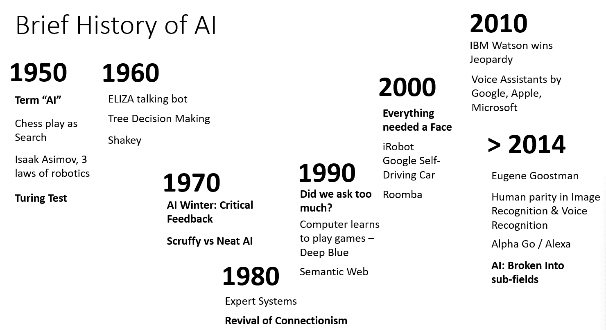
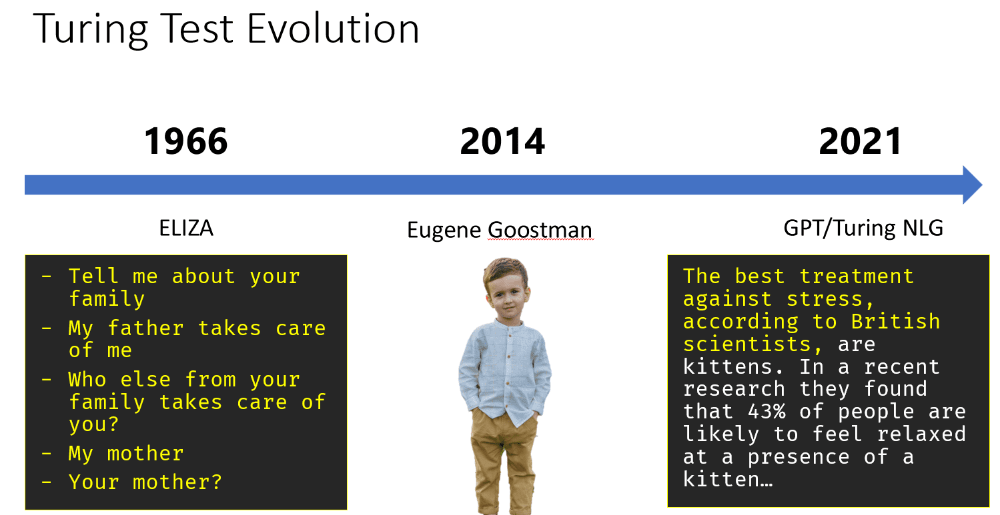
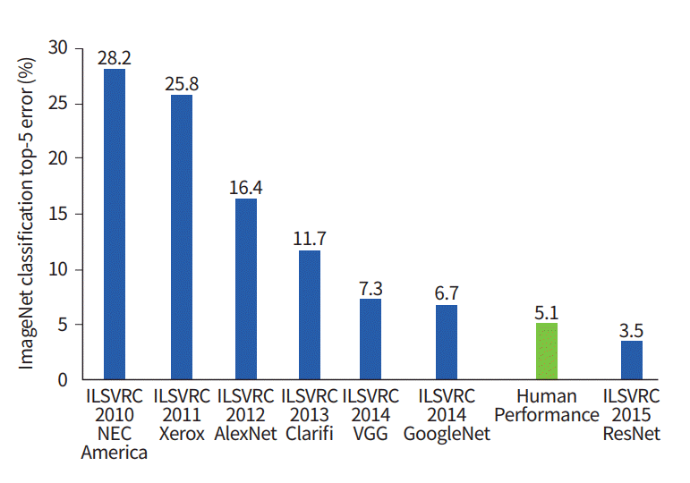
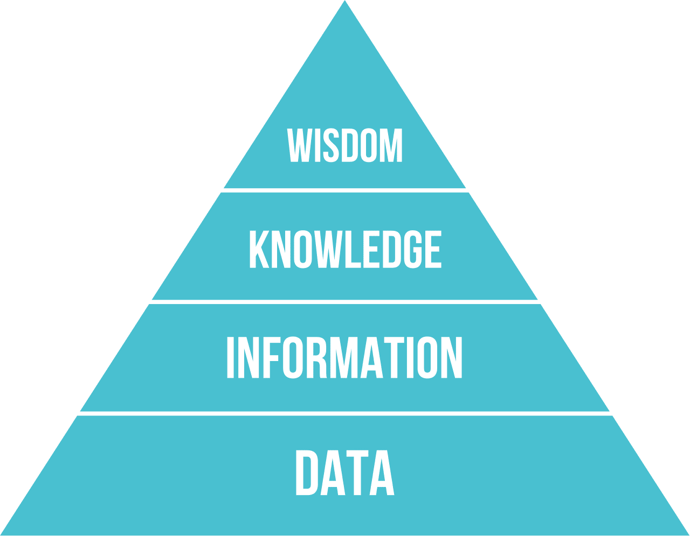
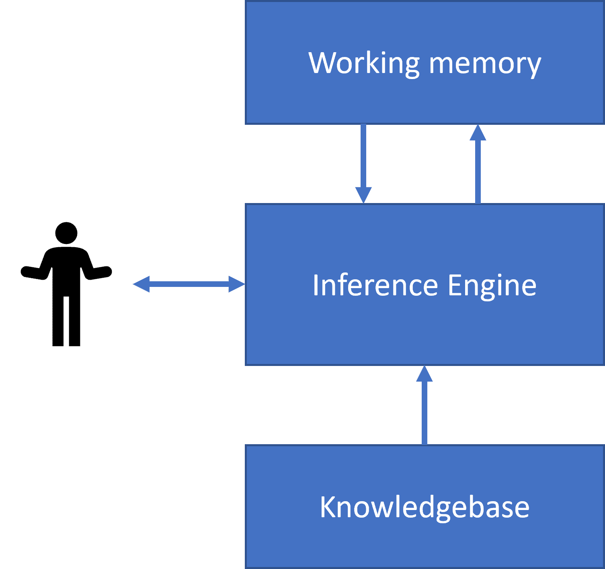

# Part 1: Introduction to AI


> Sketchnote by [Tomomi Imura](https://twitter.com/girlie_mac)

---

# What is Artificial Intelligence?

**Artificial Intelligence** is an exciting scientific discipline that studies how we can make computers exhibit intelligent behavior.

- Computers operate on algorithms: well-defined procedures
- Some tasks cannot be explicitly programmed
- Example: Determining age from a photograph

We cannot explicitly explain how we determine age, nor can we program a computer to do it traditionally.

---

# Weak AI vs. Strong AI

## Weak AI (Narrow AI)
- Designed for specific tasks
- Examples: Siri, Alexa, recommendation algorithms
- Highly specialized, lacks general intelligence

## Strong AI (AGI)
- Human-level intelligence and understanding
- Can perform any intellectual task
- Currently theoretical - not yet achieved

---

# Defining Intelligence

- No clear universal definition exists
- Connected to abstract thinking and self-awareness
- Difficult to measure objectively

{width=30%}

---

# The Turing Test

Proposed by Alan Turing as a test for machine intelligence:

- Compares system to human intelligence
- Human interrogator conducts text-based dialogue
- If interrogator cannot distinguish machine from human, system is considered intelligent

**Eugene Goostman** (2014):  

- Convinced 30% of judges it was human  
- Posed as 13-year-old Ukrainian boy  
- Demonstrated cleverness, not true intelligence  

---

# Two Main Approaches to AI

## Top-down Approach (Symbolic Reasoning)

- Models human reasoning processes
- Extracts knowledge from experts
- Represents knowledge in computer-readable form
- Uses explicit rules and logic

## Bottom-up Approach (Neural Networks)

- Models structure of human brain
- Uses interconnected neurons
- Learns from training data
- Similar to how babies learn

---

# Other Approaches

**Emergent/Synergetic Approach:**

- Complex behavior from simple agent interactions
- Intelligence emerges from reactive behaviors

**Evolutionary Approach:**

- Optimization based on evolution principles
- Genetic algorithms

---

# Brief History of AI



- **1950s-1960s:** Birth of AI, symbolic reasoning dominates
- **1970s:** AI Winter - expert systems too expensive
- **2010s:** Neural networks rise with big data
- **Today:** AI mostly synonymous with neural networks

---

# Brief History of AI

- **1950s-1960s:** Birth of AI, symbolic reasoning dominates
- **1970s:** AI Winter - expert systems too expensive
- **2010s:** Neural networks rise with big data
- **Today:** AI mostly synonymous with neural networks

---

# Evolution: Chess Programs

**Early Programs:**

- Search-based algorithms
- Alpha-beta pruning

**Middle Era:**

- Case-based reasoning
- Learning from human matches

**Modern Programs:**

- Neural networks
- Reinforcement learning
- Self-play and learning from mistakes

---

# Evolution: Conversational AI

{.center}\

**Early:** ELIZA - simple grammatical rules  
**Current:** Cortana, Siri, Google Assistant - hybrid systems  
**Future:** Complete neural-based models (GPT, Turing-NLG)

---

# Recent AI Research (2012-2020)



**2012:** Convolutional Neural Networks revolutionize image classification

**ImageNet Challenge:**

- Error rates dropped from 30% to 16.4%
- 2015: Human-level accuracy achieved

---

# Human Parity Achievements

| Year | Achievement |
|------|-------------|
| 2015 | Image Classification |
| 2016 | Conversational Speech Recognition |
| 2018 | Automatic Machine Translation |
| 2020 | Image Captioning |

**Recent Success:** Large language models (BERT, GPT-3)

---

# Key Takeaways - Part 1

1. AI aims to make computers exhibit intelligent behavior
2. Two main approaches: symbolic reasoning and neural networks
3. Neural networks currently dominate AI research
4. Massive datasets enabled recent breakthroughs
5. AI has achieved human parity in multiple domains
6. Large language models represent the cutting edge

---

# Part 2: Knowledge Representation and Expert Systems


> Sketchnote by [Tomomi Imura](https://twitter.com/girlie_mac)

---

# Introduction

**The Quest for Artificial Intelligence**

- Based on search for knowledge
- Making sense of the world like humans do
- Early AI: Top-down approach to intelligent systems
- Two big ideas:
  - Knowledge Representation
  - Reasoning

---

# What is Knowledge?

**Differentiating Concepts:**

- **Data**: What books contain (raw facts)
- **Information**: Interpreted data in our minds
- **Knowledge**: Understanding of the world
  - Obtained through active learning
  - Integrates information into our world model
  - Cannot simply be extracted from books


Knowledge is contained in our head and represents our understanding of the world

---

# The DIKW Pyramid

{width=30% .center}

**Four Levels of Understanding:**

- **Data**: Physical representation (text, words)
- **Information**: Interpreted data
- **Knowledge**: Integrated understanding
- **Wisdom**: Meta-knowledge about when to apply knowledge

*Image from Wikipedia, By Longlivetheux - Own work, CC BY-SA 4.0*

---

# Knowledge Representation Spectrum

{width=90%}

**The Challenge:**

- Left: Simple representations (algorithmic)
  - Effective for computers
  - Not flexible, non-human-like
- Right: Natural text
  - Most powerful
  - Cannot be used for automatic reasoning

<!-- > Image by [Dmitry Soshnikov](http://soshnikov.com) -->

---

# Computer Knowledge Representations

**Four Main Categories:**

1. Network representations
2. Hierarchical representations
3. Procedural representations
4. Logic-based representations

---

# 1. Network Representations

**Object-Attribute-Value Triplets**

Example: Programming Languages

| Object | Attribute | Value |
|--------|-----------|-------|
| Python | is | Untyped-Language |
| Python | invented-by | Guido van Rossum |
| Python | block-syntax | indentation |
| Untyped-Language | doesn't have | type definitions |

Based on semantic networks (graphs of interrelated concepts)

---

# 2. Hierarchical Representations

**Frame Representation: Python Example**

| Slot | Value | Default value | Interval |
|------|-------|---------------|----------|
| Name | Python | | |
| Is-A | Untyped-Language | | |
| Variable Case | | CamelCase | |
| Program Length | | | 5-5000 lines |
| Block Syntax | Indent | | |

**Features:**

- Objects/classes as frames with slots
- Default values and restrictions
- Hierarchical organization
- **Scenarios**: Special frames for temporal situations

---

# 3. Procedural Representations

**Production Rules (IF-THEN statements)**

```
IF patient has high fever
OR high C-reactive protein
THEN patient has inflammation
```

**Key Points:**  

- Condition-action pairs
- Enable drawing conclusions
- Used for forward reasoning
- Algorithms as another form (rarely used directly)

---

# 4. Logic-Based Representations

**Types of Logic:**

- **Predicate Logic**
  - Too rich for computation
  - Subsets used (e.g., Horn clauses in Prolog)
  
- **Descriptive Logic**
  - Family of logical systems
  - For object hierarchies
  - Used in semantic web

Originally proposed by Aristotle for universal knowledge

---

# Expert Systems

{width=45%} {width=45%}

**Definition:**

- Computer systems acting as domain experts
- Based on extracted human expertise
- Contain inference engine for reasoning

---

# Expert System Architecture

**Three Main Components:**

1. **Problem Memory** (Static Knowledge)
   - Current problem state
   - Temperature, symptoms, etc.

2. **Knowledge Base** (Dynamic Knowledge)
   - Long-term domain knowledge
   - Extracted from human experts
   - Navigation between states

3. **Inference Engine**
   - Orchestrates reasoning process
   - Asks questions when needed
   - Applies appropriate rules

---

# Example: Animal Classification


**Production Rule Example:**
```
IF animal eats meat
OR (animal has sharp teeth
    AND animal has claws
    AND animal has forward-looking eyes)
THEN animal is a carnivore
```

> Image by [Dmitry Soshnikov](http://soshnikov.com)

---

# Key Takeaways - Part 2

**Symbolic AI:**

- AI != Only Machine Learning/Neural Networks
- Humans exhibit explicit reasoning
- Symbolic AI still valuable for:
  - Explainable decisions
  - Controlled system behavior
  - Tasks requiring justification

**Current Status:**

- Neural networks don't handle explicit reasoning
- Real-world projects still use symbolic approaches
- Hybrid approaches gaining popularity

---

# Part 3: Introduction to Neural Networks


---

# What are Neural Networks?

**Achieving Intelligence through Training**

- Train a **computer model** or **artificial brain**
- Mathematical models researched since mid-20th century
- Recently proved hugely successful
- Also called **Artificial Neural Networks** (ANNs)

**Key Distinction:**  

- We're talking about mathematical models  
- Not real biological networks of neurons  

---

# Machine Learning Context

**Neural Networks are part of Machine Learning**

- Machine Learning: Use data to train computer models
- Large part of Artificial Intelligence
- Classical ML: SVM, KNN, Decision Trees, XGBoost 

---

# Machine Learning Tree


---

# Machine Learning Fundamentals

**Basic Setup:**

- Dataset of examples: **X**
- Corresponding output values: **Y**
- Examples: N-dimensional vectors (features)
- Outputs: Labels

**Data Representation:**

- Input dataset: Matrix of size M times N
  - M = number of samples (row)
  - N = number of features (column)
- Feature: Measurable property of input, e.g. height, weight, age
- Output labels Y: Vector of size M

---

# Two Main ML Problems

**1. Classification**

- Classify input object into 2+ classes
- Example: Is this email spam or not?
- Example: Recognize handwritten digits (0-9)

**2. Regression**

- Predict a numerical number
- Example: Predict house prices
- Example: Forecast temperature

**Our Focus:** ML and Neural network models for both problems

# Regression  


---

# Biological Inspiration

**The Human Brain:**

- Consists of neural cells (neurons)
- Multiple "inputs": **dendrites**
- Single "output": **axon**
- Connections: **synapses**
  - Varying degrees of conductivity
  - Regulated by neurotransmitters
- Both dendrites and axons conduct electrical signals

---

# Real vs. Artificial Neuron

{width=45%} {width=45%}

**Left:** Real Neuron (Image from Wikipedia)

**Right:** Artificial Neuron (Simplified mathematical model)

---

# Mathematical Model of a Neuron

**Components:**

- Multiple inputs: X1, X2, ..., XN
- Single output: Y
- Series of weights: W1, W2, ..., WN
- Activation function: f

**Output Calculation:**

$$Y = f\left(\sum_{i=1}^{N} X_i \cdot W_i\right)$$

Y = f(sum of Xi * Wi for all i)

---

# The Neuron Formula

**Mathematical Expression:**

- Weighted sum of inputs
- Applied non-linear activation function

**Why Non-linear?**

- Enables learning complex patterns
- Linear functions too simple for real-world problems
- Biological neurons also non-linear

---

# Historical Foundation

**Early Research (1943):**

- Warren McCulloch and Walter Pitts
- Paper: "A logical calculus of the ideas immanent in nervous activity"
- First mathematical model of neurons

**Learning Theory (1949):**

- Donald Hebb
- Book: "The Organization of Behavior: A Neuropsychological Theory"
- Proposed how networks can be trained
- **Hebbian Learning**: "Cells that fire together, wire together"

---

# Course Structure

**Topics Covered:**

1. **Perceptron**
   - One of the earliest neural network models
   - Two-class classification

2. **Multi-layered Networks**
   - Building our own framework
   - Understanding deep architecture

---

# Course Structure (continued)

**Topics Covered:**

3. **ML and Neural Network Frameworks**
   - ML: Scikit-learn
   - NN: PyTorch


4. **Overfitting**
   - Common problem in neural networks
   - Prevention techniques
   - Regularization methods

---

# Section 1: Perceptron

**What is a Perceptron?**

- Earliest neural network model
- Binary classification
- Single-layer architecture
- Foundation for modern neural networks

**Learn more:** See Perceptron README

---

# Section 2: Multi-layered Networks

**Going Deeper:**

- Multiple layers of neurons
- Hidden layers
- Building blocks of deep learning

**Hands-on Practice:**

- Code MLP Using SciKit-Learn for diabetes dataset
- Understand backpropagation
- See how training works internally

---

# Section 4: Overfitting

**What is Overfitting?**

- Model learns training data too well
- Poor generalization to new data
- Memorization vs. learning

**Prevention Techniques:**

- Regularization (L1, L2)
- Dropout
- Early stopping
- Data augmentation
- Cross-validation

---

# Overfitting Visualization

{width=45%} {width=45%}

**Signs of Overfitting:**

- Training accuracy: Very high
- Validation accuracy: Much lower
- Model too complex for the data

---

# Overfitting Diagram

{.center}\

**Three Scenarios:**

- **Underfitting**: Too simple, misses patterns
- **Good fit**: Captures patterns, generalizes well
- **Overfitting**: Too complex, captures noise

---

# Key Concepts Summary

**Neural Networks:**

- Mathematical models inspired by the brain
- Consist of interconnected artificial neurons
- Learn from data through training

**Core Components:**

- Inputs with weights
- Activation functions
- Multiple layers
- Backpropagation for training

---

# Learning Objectives

**By the end of this section, you will:**

1. Understand neuron mathematical models
2. Build neural networks from scratch
3. Use industry-standard frameworks
4. Recognize and prevent overfitting
5. Apply neural networks to real problems

---

# Why Neural Networks?

**Advantages:**

- Learn complex non-linear patterns
- Automatic feature extraction
- Scalable to large datasets
- State-of-the-art in many domains

**Applications:**

- Image recognition
- Natural language processing
- Speech recognition
- Game playing (AlphaGo)
- Autonomous vehicles

---

# Getting Started

**Prerequisites:**

- Basic Python programming
- Linear algebra fundamentals
- Understanding of calculus (derivatives)
- Familiarity with NumPy

**Tools Needed:**

- Python 3.x
- VSCode and/or Jupyter Notebook
- PyTorch
- Scikit-learn
- NumPy, Matplotlib
- SHAP: Explainable AI
- Nkululeko: Audio AI

---

# From Perceptron to Deep Learning

**Evolution of Neural Networks:**

- 1943: Mathematical model (McCulloch-Pitts)
- 1958: Perceptron (Rosenblatt)
- 1969: Limitations discovered (Minsky & Papert)
- 1986: Backpropagation (Rumelhart et al.)
- 2006: Deep Learning renaissance (Hinton)
- 2012+: Modern deep learning era

---

# Training Neural Networks

**The Learning Process:**

1. **Initialize** weights randomly
2. **Forward pass**: Compute predictions
3. **Calculate loss**: Measure error
4. **Backward pass**: Compute gradients
5. **Update weights**: Gradient descent
6. **Repeat** until convergence

---

# Activation Functions

**Common Functions:**

- **Sigmoid**: $\sigma(x) = \frac{1}{1+e^{-x}}$
  - Output: (0, 1)
  - Used in binary classification

- **ReLU**: f(x) = max(0, x)
  - Most popular in hidden layers
  - Solves vanishing gradient problem

- **Softmax**: For multi-class classification
  - Outputs probability distribution

---

# Neural Network Architectures

**Types of Networks:**

- **Feedforward**: Data flows in one direction
- **Convolutional (CNN)**: For images
- **Recurrent (RNN)**: For sequences
- **Transformer**: For language tasks
- **Generative Adversarial (GAN)**: For generation

**This Section:** Focus on feedforward networks

---

# Practical Considerations

**Model Design:**

- Number of layers
- Number of neurons per layer
- Choice of activation functions
- Learning rate selection

**Training Tips:**

- Batch size selection
- Number of epochs
- Monitoring validation loss
- Using callbacks

---

# Common Challenges

**Training Issues:**

- Vanishing/exploding gradients
- Overfitting (memorization)
- Underfitting (too simple)
- Slow convergence
- Getting stuck in local minima

**Solutions:**

- Proper initialization
- Batch normalization
- Regularization
- Learning rate scheduling
- Early stopping

---

# The Perceptron: Historical Background

**Frank Rosenblatt (1957)**

- Cornell Aeronautical Laboratory
- First hardware implementation: "Mark-1"
- Designed to recognize primitive geometric figures
- Triangles, squares, and circles

**Input Representation:**

- 20x20 photocell array
- 400 inputs
- One binary output

---

# The Mark-1 Perceptron

{width=45%} {width=45%}

Images from Wikipedia

---

# Mark-1 Architecture

**Simple Neural Network:**

- Single neuron (threshold logic unit)
- Neural network weights as potentiometers
- Manual adjustment during training phase

**Potentiometer:** Device allowing user to adjust circuit resistance

---

# Contemporary Expectations

**The New York Times wrote:**

> "The embryo of an electronic computer that [the Navy] expects will be able to walk, talk, see, write, reproduce itself and be conscious of its existence."

**Reality vs. Expectations:**

- Revolutionary for its time
- But had significant limitations
- Led to "AI Winter" in 1969

---

# Perceptron Model

**Binary Classification Model**

- Distinguishes between two classes
- Input vector: x (size N features)
- Output: +1 or -1

**Output Formula:**

$$ y(x) = f(w^T x) $$

where $f$ is a step activation function

---

# Step Activation Function

**Function Definition:**

$$
f(x) = \begin{cases}
+1 & \text{if } x \geq 0 \\
-1 & \text{if } x < 0
\end{cases}
$$

**Characteristics:**

- Binary output
- Sharp threshold at zero
- Non-differentiable (causes training challenges)

---

# Training the Perceptron

**Goal:** Find weights vector $w$ that:

- Classifies most values correctly
- Results in the smallest error

**Perceptron Criterion:**

$$E(w) = -\sum (w^T x_i t_i) $$

where:

- Sum taken on misclassified training points
- $x_i$ = input data
- $t_i$ = -1 or +1 (target labels)

---

# Gradient Descent

**Optimization Method:**

Start with initial weights $w^{(0)}$

Update at each step:

$$w^{(t+1)} = w^{(t)} - \eta \cdot \nabla E(w)$$

where:

- $\eta$ = learning rate
- $\nabla E(w)$ = gradient of error

**Final Update Rule:**

$$w^{(t+1)} = w^{(t)} + \sum (\eta \cdot x_i \cdot t_i)$$

---

# Training Algorithm Components

**Key Elements:**

- **Learning Rate (eta):** Controls step size
- **Gradient:** Direction of steepest descent
- **Weight Update:** Adjust based on errors
- **Iteration:** Repeat until convergence

**Process:**

1. Initialize weights
2. Compute output
3. Calculate error
4. Update weights
5. Repeat

---

# Python Implementation

```python
def train(positive_examples, negative_examples, 
          num_iterations = 100, eta = 1):
    
    weights = [0,0,0] # Initialize weights
    
    for i in range(num_iterations):
        pos = random.choice(positive_examples)
        neg = random.choice(negative_examples)
        
        z = np.dot(pos, weights)
        if z < 0: # positive misclassified
            weights = weights + eta*weights.shape
        
        z = np.dot(neg, weights)
        if z >= 0: # negative misclassified
            weights = weights - eta*weights.shape
    
    return weights
```

---

# Training Process Explained

**Step-by-Step:**

1. **Initialize:** Random or zero weights
2. **Select Samples:** Pick positive and negative examples
3. **Compute Output:** Calculate $z = w^T x$
4. **Check Classification:**
   - If positive classified as negative: increase weights
   - If negative classified as positive: decrease weights
5. **Iterate:** Repeat for num_iterations

---

# Learning Rate Selection

**eta (Learning Rate):**

- **Too Large:** 
  - Overshooting optimal weights
  - Oscillation, no convergence
  
- **Too Small:**
  - Slow convergence
  - Many iterations needed
  
- **Just Right:**
  - Steady progress
  - Efficient convergence

**Typical Range:** 0.001 to 0.1

---

# Perceptron Limitations

**Discovered by Minsky & Papert (1969):**

**Cannot solve XOR problem:**

- Non-linearly separable data
- Need multiple layers
- Led to first "AI Winter"

**Other Limitations:**

- Only linear decision boundaries
- Sensitive to outliers
- No probabilistic outputs
- Single layer architecture

---

# XOR Problem Illustration

**Truth Table:**

| X1 | X2 | XOR |
|----|----|----|
| 0  | 0  | 0  |
| 0  | 1  | 1  |
| 1  | 0  | 1  |
| 1  | 1  | 0  |

**Problem:** Cannot draw single straight line to separate classes

**Solution:** Multi-layer perceptron (MLP)

---

# When Perceptrons Work Well

**Linearly Separable Problems:**

- Binary classification
- Simple pattern recognition
- Text classification (bag of words)
- Spam detection
- Simple geometric shapes

**Advantages:**

- Fast training
- Simple to implement
- Interpretable weights
- Foundation for understanding deep learning

---

# From Perceptron to Modern Networks

**Evolution:**

1. **1958:** Single-layer perceptron
2. **1969:** Limitations discovered
3. **1986:** Multi-layer perceptron + backpropagation
4. **1990s:** Support Vector Machines dominate
5. **2006:** Deep learning renaissance
6. **2012+:** Modern deep neural networks

---

# Multi-Layer Perceptron (MLP)

**Solving Perceptron Limitations:**

- Add hidden layers
- Use differentiable activation functions
- Backpropagation for training
- Can solve XOR and complex problems

**Architecture:**

- Input layer
- One or more hidden layers
- Output layer

---

# Practical Applications Today

**Where Perceptrons Are Still Used:**

1. **Linear Classifiers:**
   - Simple baseline models
   - Feature importance analysis
   
2. **Ensemble Components:**
   - Part of voting systems
   - Combination with other models

3. **Educational Purposes:**
   - Understanding neural network basics
   - Introduction to gradient descent

---

# Perceptron vs. Modern Networks

| Feature | Perceptron | Modern DNNs |
|---------|-----------|-------------|
| Layers | Single | Multiple |
| Activation | Step | ReLU, Sigmoid, etc. |
| Training | Simple rule | Backpropagation |
| Capacity | Linear only | Non-linear |
| Speed | Very fast | Slower |
| Applications | Limited | Universal |

---

# Key Takeaways - Perceptron

**Essential Concepts:**

1. First artificial neural network model
2. Binary classification using weighted sum
3. Step activation function
4. Gradient descent training
5. Linear decision boundary limitation
6. Foundation for modern deep learning

---

# Debugging Perceptron Training

**Common Issues:**

- **Not Converging:**
  - Adjust learning rate
  - Check data separability
  - Increase iterations

- **Poor Performance:**
  - Data not linearly separable
  - Need feature engineering
  - Consider MLP instead

---

# Feature Engineering for Perceptrons

**Improving Performance:**

- **Polynomial Features:** $x$, $x^2$, $x^3$
- **Interaction Terms:** $x_1 \cdot x_2$
- **Normalization:** Scale features
- **Domain Knowledge:** Create relevant features

**Goal:** Make data linearly separable

---

# Visualization Techniques

**Understanding Perceptron:**

1. **Decision Boundary:** Plot separating line
2. **Weight Vector:** Direction of classification
3. **Training Progress:** Error over iterations
4. **Feature Space:** 2D/3D projections

**Tools:**

- Matplotlib for plotting
- Seaborn for visualization
- Interactive plots with Plotly

---

# Perceptron Convergence Theorem

**Theoretical Guarantee:**

If data is linearly separable:

- Perceptron will converge
- Finite number of iterations
- Find perfect separator

**Conditions:**

- Data must be linearly separable
- Finite dataset
- Proper learning rate

---

# Modern Variants

**Extensions and Improvements:**

1. **Voted Perceptron:**
   - Multiple weight vectors
   - Voting scheme

2. **Averaged Perceptron:**
   - Average all weight vectors
   - Better generalization

3. **Kernel Perceptron:**
   - Non-linear decision boundaries
   - Kernel trick application

---

# Summary and Conclusion

**Perceptron Legacy:**

- Historical significance in AI
- Foundation of neural networks
- Still relevant for education
- Simple yet powerful concept

**Next Steps:**

- Multi-layer networks
- Backpropagation
- Modern frameworks (PyTorch, TensorFlow)

---

# Final Thoughts

**Why Study AI and ML?**

1. Understand the foundations of modern AI
2. Grasp both symbolic and neural approaches
3. Appreciate deep learning evolution
4. Build intuition for complex models

**Remember:**

- AI is diverse: symbolic reasoning AND neural networks
- Every deep network is built on fundamental principles
- Simple models teach important lessons
- Start simple, scale complexity gradually

---

# AI for Healthcare: virtual doctor

{.center}\

---

# Pareto Frontier: Diagnostic Accuracy 


---

# Discussion and Quiz

**Part 1 AI:**

- Pre-lecture quiz: <https://ff-quizzes.netlify.app/en/ai/quiz/1>
- Post-lecture quiz: <https://ff-quizzes.netlify.app/en/ai/quiz/2>


**Part 2 Perceptron:**

- Pre-lecture quiz: <https://ff-quizzes.netlify.app/en/ai/quiz/3>
- Post-lecture quiz: <https://ff-quizzes.netlify.app/en/ai/quiz/4>  

**ML Resources:**

- Pre-lecture quiz: <https://ff-quizzes.netlify.app/en/ml/quiz/7>
- Post-lecture quiz: <https://ff-quizzes.netlify.app/en/ml/quiz/8>

---