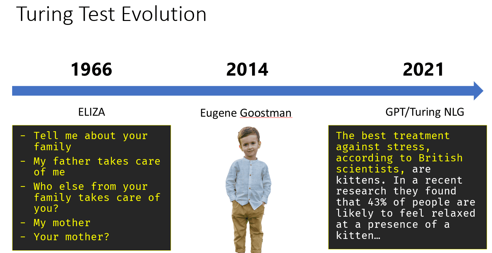

# Introduction to AI

> Sketchnote by [Tomomi Imura](https://twitter.com/girlie_mac)

---

# What is Artificial Intelligence?

**Artificial Intelligence** is an exciting scientific discipline that studies how we can make computers exhibit intelligent behavior.

- Computers operate on algorithms - well-defined procedures
- Some tasks cannot be explicitly programmed
- Example: Determining age from a photograph

> We cannot explicitly explain how we determine age, nor can we program a computer to do it traditionally.

---

# Weak AI vs. Strong AI

## Weak AI (Narrow AI)
- Designed for specific tasks
- Examples: Siri, Alexa, recommendation algorithms
- Highly specialized, lacks general intelligence

## Strong AI (AGI)
- Human-level intelligence and understanding
- Can perform any intellectual task
- Currently theoretical - not yet achieved

---

# Defining Intelligence

- No clear universal definition exists
- Connected to abstract thinking and self-awareness
- Difficult to measure objectively

> Question: Is a cat intelligent? Different people give different answers!

---

# The Turing Test

Proposed by Alan Turing as a test for machine intelligence:

- Compares system to human intelligence
- Human interrogator conducts text-based dialogue
- If interrogator cannot distinguish machine from human, system is considered intelligent

**Eugene Goostman** (2014):
- Convinced 30% of judges it was human
- Posed as 13-year-old Ukrainian boy
- Demonstrated cleverness, not true intelligence

---

# Two Main Approaches to AI

## Top-down Approach (Symbolic Reasoning)
- Models human reasoning processes
- Extracts knowledge from experts
- Represents knowledge in computer-readable form
- Uses explicit rules and logic

## Bottom-up Approach (Neural Networks)
- Models structure of human brain
- Uses interconnected neurons
- Learns from training data
- Similar to how babies learn

---

# Other Approaches

**Emergent/Synergetic Approach:**
- Complex behavior from simple agent interactions
- Intelligence emerges from reactive behaviors

**Evolutionary Approach:**
- Optimization based on evolution principles
- Genetic algorithms

---

# Brief History of AI

- **1950s-1960s:** Birth of AI, symbolic reasoning dominates
- **1970s:** AI Winter - expert systems too expensive
- **2010s:** Neural networks rise with big data
- **Today:** AI mostly synonymous with neural networks

---

# Evolution: Chess Programs

**Early Programs:**
- Search-based algorithms
- Alpha-beta pruning

**Middle Era:**
- Case-based reasoning
- Learning from human matches

**Modern Programs:**
- Neural networks
- Reinforcement learning
- Self-play and learning from mistakes

---

# Evolution: Conversational AI

**Early:** ELIZA - simple grammatical rules

**Current:** Cortana, Siri, Google Assistant - hybrid systems

**Future:** Complete neural-based models (GPT, Turing-NLG)

---

# Recent AI Research (2012-2020)

**2012:** Convolutional Neural Networks revolutionize image classification

**ImageNet Challenge:**
- Error rates dropped from 30% to 16.4%
- 2015: Human-level accuracy achieved

---

# Human Parity Achievements

| Year | Achievement |
|------|-------------|
| 2015 | Image Classification |
| 2016 | Conversational Speech Recognition |
| 2018 | Automatic Machine Translation |
| 2020 | Image Captioning |

**Recent Success:** Large language models (BERT, GPT-3)

---

# Key Takeaways

1. AI aims to make computers exhibit intelligent behavior
2. Two main approaches: symbolic reasoning and neural networks
3. Neural networks currently dominate AI research
4. Massive datasets enabled recent breakthroughs
5. AI has achieved human parity in multiple domains
6. Large language models represent the cutting edge

---

# Challenge & Review

**Challenge:**
- Research where AI is most effectively used
- Investigate how these systems were built

**Review:**
- Explore the history of AI and ML
- Research cultural context of AI evolution
- Complete the Game Jam assignment

---

# Resources

- Pre-lecture quiz: https://ff-quizzes.netlify.app/en/ai/quiz/1
- Post-lecture quiz: https://ff-quizzes.netlify.app/en/ai/quiz/2
- ML for Beginners: http://aka.ms/ml-beginners
- Assignment: Game Jam