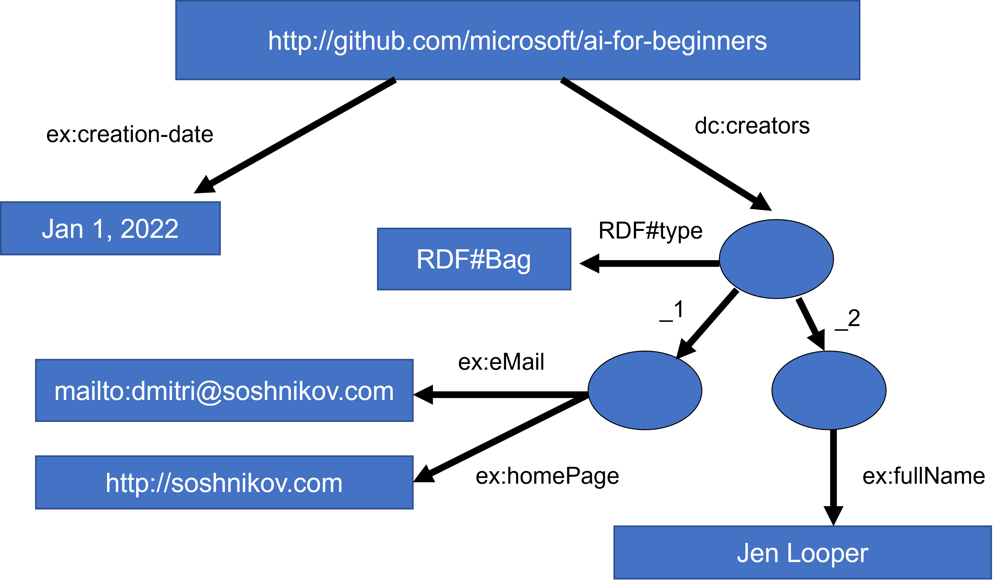

# Knowledge Representation and Expert Systems


> Sketchnote by [Tomomi Imura](https://twitter.com/girlie_mac)

---

# Introduction

**The Quest for Artificial Intelligence**

- Based on search for knowledge
- Making sense of the world like humans do
- Early AI: Top-down approach to intelligent systems
- Two big ideas:
  - Knowledge Representation
  - Reasoning

---

# What is Knowledge?

**Differentiating Concepts:**

- **Data**: What books contain (raw facts)
- **Information**: Interpreted data in our minds
- **Knowledge**: Understanding of the world
  - Obtained through active learning
  - Integrates information into our world model
  - Cannot simply be extracted from books

> Knowledge is contained in our head and represents our understanding of the world

---

# The DIKW Pyramid


**Four Levels of Understanding:**

- **Data**: Physical representation (text, words)
- **Information**: Interpreted data
- **Knowledge**: Integrated understanding
- **Wisdom**: Meta-knowledge about when to apply knowledge

*Image from Wikipedia, By Longlivetheux - Own work, CC BY-SA 4.0*

---

# Knowledge Representation Spectrum


**The Challenge:**

- Left: Simple representations (algorithmic)
  - Effective for computers
  - Not flexible, non-human-like
- Right: Natural text
  - Most powerful
  - Cannot be used for automatic reasoning

> Image by [Dmitry Soshnikov](http://soshnikov.com)

---

# Computer Knowledge Representations

**Four Main Categories:**

1. Network representations
2. Hierarchical representations
3. Procedural representations
4. Logic-based representations

---

# 1. Network Representations

**Object-Attribute-Value Triplets**

Example: Programming Languages

| Object | Attribute | Value |
|--------|-----------|-------|
| Python | is | Untyped-Language |
| Python | invented-by | Guido van Rossum |
| Python | block-syntax | indentation |
| Untyped-Language | doesn't have | type definitions |

Based on semantic networks (graphs of interrelated concepts)

---

# 2. Hierarchical Representations

**Frame Representation: Python Example**

| Slot | Value | Default value | Interval |
|------|-------|---------------|----------|
| Name | Python | | |
| Is-A | Untyped-Language | | |
| Variable Case | | CamelCase | |
| Program Length | | | 5-5000 lines |
| Block Syntax | Indent | | |

**Features:**
- Objects/classes as frames with slots
- Default values and restrictions
- Hierarchical organization
- **Scenarios**: Special frames for temporal situations

---

# 3. Procedural Representations

**Production Rules (IF-THEN statements)**

```
IF patient has high fever
OR high C-reactive protein
THEN patient has inflammation
```

**Key Points:**
- Condition-action pairs
- Enable drawing conclusions
- Used for forward reasoning
- Algorithms as another form (rarely used directly)

---

# 4. Logic-Based Representations

**Types of Logic:**

- **Predicate Logic**
  - Too rich for computation
  - Subsets used (e.g., Horn clauses in Prolog)
  
- **Descriptive Logic**
  - Family of logical systems
  - For object hierarchies
  - Used in semantic web

Originally proposed by Aristotle for universal knowledge

---

# Expert Systems

{width=45%} {width=45%}

**Definition:**
- Computer systems acting as domain experts
- Based on extracted human expertise
- Contain inference engine for reasoning

---

# Expert System Architecture

**Three Main Components:**

1. **Problem Memory** (Static Knowledge)
   - Current problem state
   - Temperature, symptoms, etc.

2. **Knowledge Base** (Dynamic Knowledge)
   - Long-term domain knowledge
   - Extracted from human experts
   - Navigation between states

3. **Inference Engine**
   - Orchestrates reasoning process
   - Asks questions when needed
   - Applies appropriate rules

---

# Example: Animal Classification


**Production Rule Example:**
```
IF animal eats meat
OR (animal has sharp teeth
    AND animal has claws
    AND animal has forward-looking eyes)
THEN animal is a carnivore
```

> Image by [Dmitry Soshnikov](http://soshnikov.com)

---

# Forward Inference

**Process Flow:**

1. Start with initial problem data
2. Check if target attribute is found -> Stop
3. Find all applicable rules (conflict set)
4. Perform conflict resolution:
   - First applicable rule
   - Random selection
   - Most specific rule
5. Apply selected rule
6. Repeat from step 1

**Use Case:** When you have initial data and want to reach conclusions

---

# Backward Inference

**Process Flow:**

1. Start with a goal attribute
2. Select rules that can prove the goal
3. If no rules exist -> Ask user
4. Select hypothesis rule (conflict resolution)
5. Recursively prove all conditions
6. If fails -> Try another rule

**Use Case:** Medical diagnosis - ask questions as needed, don't run all tests upfront

---

# Implementing Expert Systems

**Two Main Approaches:**

1. **Direct Programming**
   - Not recommended
   - Knowledge not separated from inference
   - Hard for domain experts to maintain

2. **Expert Systems Shell**
   - Specialized system for knowledge
   - Uses knowledge representation language
   - Separates knowledge from reasoning
   - Domain experts can add rules

---

# Ontologies and Semantic Web

**Initiative (Late 20th Century):**
- Annotate Internet resources with knowledge
- Enable specific, intelligent queries

**Based on Three Concepts:**

1. **Description Logics (DL)**
   - Similar to frame representation
   - Formal logical semantics
   - Balance expressiveness vs. complexity

2. **Distributed Representation**
   - Global URI identifiers
   - Knowledge spans the internet

3. **XML-Based Languages**
   - RDF (Resource Description Framework)
   - RDFS (RDF Schema)
   - OWL (Ontology Web Language)

---

# What is an Ontology?

**Definition:**
- Explicit specification of a problem domain
- Uses formal knowledge representation

**Complexity Levels:**
- Simple: Just hierarchy of objects
- Complex: Include inference rules

**Core Concept:** Semantic Web foundation

---

# Semantic Web: Triplets

**Example: AI Curriculum Authorship**


```
http://github.com/microsoft/ai-for-beginners 
  http://www.example.com/terms/creation-date 
  "Jan 13, 2007"

http://github.com/microsoft/ai-for-beginners 
  http://purl.org/dc/elements/1.1/creator 
  http://soshnikov.com
```

**Key Features:**
- Objects and relations identified by URI
- Universally accepted concept identifiers

---

# Complex Triplets



**For Multiple Creators:**
- Use RDF data structures
- Define lists and collections
- Maintain relationship integrity

> Diagrams by [Dmitry Soshnikov](http://soshnikov.com)

---

# Notable Projects

**WikiData**
- Machine-readable knowledge bases
- Associated with Wikipedia
- Mined from InfoBoxes
- Query using SPARQL

**Example Query:** Most popular human eye colors
```sparql
#defaultView:BubbleChart
SELECT ?eyeColorLabel (COUNT(?human) AS ?count)
WHERE {
  ?human wdt:P31 wd:Q5.       # homo sapiens
  ?human wdt:P1340 ?eyeColor. # eye color
  SERVICE wikibase:label { 
    bd:serviceParam wikibase:language "en". 
  }
}
GROUP BY ?eyeColorLabel
```

---

# Tools: Protégé


**Visual Ontology Editor**
- Download or use online
- Create and edit ontologies
- Visualize knowledge hierarchies

*Web Protégé editor with Romanov Family ontology. Screenshot by Dmitry Soshnikov*

---

# Microsoft Concept Graph

**Overview:**
- Mines ontologies from unstructured data
- Natural language text processing
- Large entity collection

**Features:**
- `is-a` inheritance relationships
- Probabilistic answers
  - "Microsoft" -> "company" (0.87 probability)
  - "Microsoft" -> "brand" (0.75 probability)

**Access:**
- REST API
- Downloadable text file

---

# Real-World Applications

**Use Cases for Symbolic AI:**

1. **Medical Diagnosis**
   - Expert systems in healthcare
   - Explainable decision-making

2. **Knowledge Management**
   - Semantic web applications
   - Intelligent search

3. **Business Rules**
   - Automated decision systems
   - Compliance checking

4. **Educational Systems**
   - Intelligent tutoring
   - Concept mapping

---

# Exercises

**Three Hands-On Notebooks:**

1. **Animals.ipynb**
   - Forward and backward inference
   - Expert system implementation
   - Requires ~200+ rules for intelligent behavior

2. **FamilyOntology.ipynb**
   - Semantic web techniques
   - GEDCOM format processing
   - Family relationship reasoning

3. **MSConceptGraph.ipynb**
   - Microsoft Concept Graph usage
   - News article categorization
   - Automated grouping

---

# Conclusion

**Key Takeaways:**

- AI != Only Machine Learning/Neural Networks
- Humans exhibit explicit reasoning
- Symbolic AI still valuable for:
  - Explainable decisions
  - Controlled system behavior
  - Tasks requiring justification

**Current Status:**
- Neural networks don't handle explicit reasoning
- Real-world projects still use symbolic approaches
- Hybrid approaches gaining popularity

---

# Challenge & Review

**Challenge:**
- Experiment with Family Ontology notebook
- Discover new connections in family trees
- Try different family relations

**Review Topics:**
- Bloom's Taxonomy
- Linnaeus: taxonomy of organisms
- Mendeleev: periodic table organization
- Other historical knowledge codification

**Assignment:** Build an Ontology

---

# Resources

- Pre-lecture quiz: https://ff-quizzes.netlify.app/en/ai/quiz/3
- Post-lecture quiz: https://ff-quizzes.netlify.app/en/ai/quiz/4
- Animals.ipynb exercise
- FamilyOntology.ipynb exercise
- MSConceptGraph.ipynb exercise
- Assignment: Build an Ontology

---

# Thank You!

**Questions?**

Continue exploring:
- Protégé ontology editor
- WikiData SPARQL queries
- Microsoft Concept Graph
- Historical knowledge systems

**Next Lesson:** Moving forward in AI for Beginners
