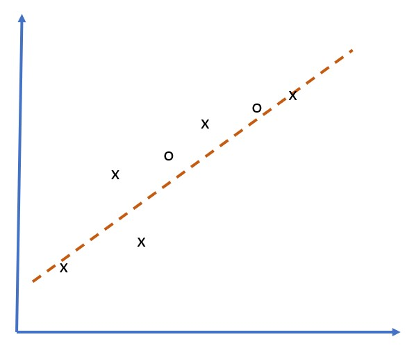
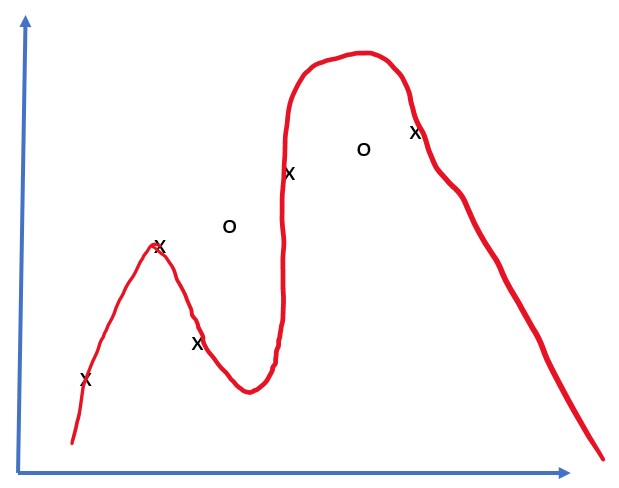
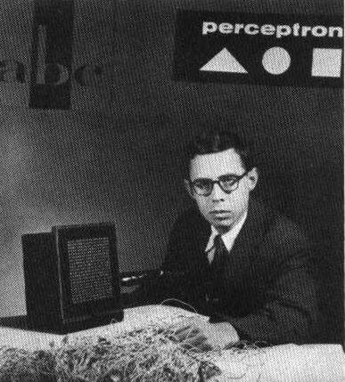

# Introduction to Neural Networks


---

# What are Neural Networks?

**Achieving Intelligence through Training**

- Train a **computer model** or **artificial brain**
- Mathematical models researched since mid-20th century
- Recently proved hugely successful
- Also called **Artificial Neural Networks** (ANNs)

**Key Distinction:**  

- We're talking about mathematical models  
- Not real biological networks of neurons  

---

# Machine Learning Context

**Neural Networks are part of Machine Learning**

- Machine Learning: Use data to train computer models
- Large part of Artificial Intelligence
- Classical ML not covered in this curriculum

> Visit **[Machine Learning for Beginners](http://github.com/microsoft/ml-for-beginners)** curriculum to learn more about classic Machine Learning

---

# Machine Learning Fundamentals

**Basic Setup:**

- Dataset of examples: **X**
- Corresponding output values: **Y**
- Examples: N-dimensional vectors (features)
- Outputs: Labels

**Data Representation:**

- Input dataset: Matrix of size M times N
  - M = number of samples
  - N = number of features
- Output labels Y: Vector of size M

---

# Two Main ML Problems

**1. Classification**

- Classify input object into 2+ classes
- Example: Is this email spam or not?
- Example: Recognize handwritten digits (0-9)

**2. Regression**

- Predict a numerical number
- Example: Predict house prices
- Example: Forecast temperature

**Our Focus:** Neural network models for both problems

---

# Biological Inspiration

**The Human Brain:**

- Consists of neural cells (neurons)
- Multiple "inputs": **dendrites**
- Single "output": **axon**
- Connections: **synapses**
  - Varying degrees of conductivity
  - Regulated by neurotransmitters
- Both dendrites and axons conduct electrical signals

---

# Real vs. Artificial Neuron

{width=45%} {width=45%}

**Left:** Real Neuron (Image from Wikipedia)

**Right:** Artificial Neuron (Simplified mathematical model)

---

# Mathematical Model of a Neuron

**Components:**

- Multiple inputs: X1, X2, ..., XN
- Single output: Y
- Series of weights: W1, W2, ..., WN
- Activation function: f

**Output Calculation:**

$$Y = f\left(\sum_{i=1}^{N} X_i \cdot W_i\right)$$

Y = f(sum of Xi * Wi for all i)

---

# The Neuron Formula

**Mathematical Expression:**

- Weighted sum of inputs
- Applied non-linear activation function

**Why Non-linear?**

- Enables learning complex patterns
- Linear functions too simple for real-world problems
- Biological neurons also non-linear

---

# Historical Foundation

**Early Research (1943):**

- Warren McCulloch and Walter Pitts
- Paper: "A logical calculus of the ideas immanent in nervous activity"
- First mathematical model of neurons

**Learning Theory (1949):**

- Donald Hebb
- Book: "The Organization of Behavior: A Neuropsychological Theory"
- Proposed how networks can be trained
- **Hebbian Learning**: "Cells that fire together, wire together"

---

# Course Structure

**Topics Covered:**

1. **Perceptron**
   - One of the earliest neural network models
   - Two-class classification

2. **Multi-layered Networks**
   - Building our own framework
   - Understanding deep architecture

---

# Course Structure (continued)

**Topics Covered:**

3. **Neural Network Frameworks**
   - PyTorch
   - Keras/TensorFlow
   - Industry-standard tools

4. **Overfitting**
   - Common problem in neural networks
   - Prevention techniques
   - Regularization methods

---

# Section 1: Perceptron

**What is a Perceptron?**

- Earliest neural network model
- Binary classification
- Single-layer architecture
- Foundation for modern neural networks

**Learn more:** See Perceptron README

---

# Section 2: Multi-layered Networks

**Going Deeper:**

- Multiple layers of neurons
- Hidden layers
- Building blocks of deep learning

**Hands-on Practice:**

- Build your own framework
- Understand backpropagation
- See how training works internally

**Notebook:** OwnFramework.ipynb

---

# Section 3: Neural Network Frameworks

**Modern Tools:**

**PyTorch**
- Dynamic computational graphs
- Research-friendly
- Python-first approach
- Notebook: IntroPyTorch.ipynb

**Keras/TensorFlow**
- High-level API
- Production-ready
- Easy to use
- Notebook: IntroKerasTF.ipynb

---

# Section 4: Overfitting

**What is Overfitting?**

- Model learns training data too well
- Poor generalization to new data
- Memorization vs. learning

**Prevention Techniques:**

- Regularization (L1, L2)
- Dropout
- Early stopping
- Data augmentation
- Cross-validation

---

# Overfitting Visualization

{width=45%} {width=45%}

**Signs of Overfitting:**

- Training accuracy: Very high
- Validation accuracy: Much lower
- Model too complex for the data

---

# Overfitting Diagram


**Three Scenarios:**

- **Underfitting**: Too simple, misses patterns
- **Good fit**: Captures patterns, generalizes well
- **Overfitting**: Too complex, captures noise

---

# Key Concepts Summary

**Neural Networks:**
- Mathematical models inspired by the brain
- Consist of interconnected artificial neurons
- Learn from data through training

**Core Components:**
- Inputs with weights
- Activation functions
- Multiple layers
- Backpropagation for training

---

# Learning Objectives

**By the end of this section, you will:**

1. Understand neuron mathematical models
2. Build neural networks from scratch
3. Use industry-standard frameworks
4. Recognize and prevent overfitting
5. Apply neural networks to real problems

---

# Why Neural Networks?

**Advantages:**

- Learn complex non-linear patterns
- Automatic feature extraction
- Scalable to large datasets
- State-of-the-art in many domains

**Applications:**

- Image recognition
- Natural language processing
- Speech recognition
- Game playing (AlphaGo)
- Autonomous vehicles

---

# Getting Started

**Prerequisites:**

- Basic Python programming
- Linear algebra fundamentals
- Understanding of calculus (derivatives)
- Familiarity with NumPy

**Tools Needed:**

- Python 3.x
- Jupyter Notebook
- PyTorch or TensorFlow
- NumPy, Matplotlib

---

# Hands-On Practice

**Notebooks Available:**

1. **OwnFramework.ipynb**
   - Build neural network from scratch
   - Understand backpropagation
   - Implement gradient descent

2. **IntroPyTorch.ipynb**
   - PyTorch basics
   - Build models with PyTorch
   - Training and evaluation

3. **IntroKerasTF.ipynb**
   - Keras/TensorFlow basics
   - Sequential and Functional APIs
   - Model deployment

---

# From Perceptron to Deep Learning

**Evolution of Neural Networks:**

- 1943: Mathematical model (McCulloch-Pitts)
- 1958: Perceptron (Rosenblatt)
- 1969: Limitations discovered (Minsky & Papert)
- 1986: Backpropagation (Rumelhart et al.)
- 2006: Deep Learning renaissance (Hinton)
- 2012+: Modern deep learning era

---

# Training Neural Networks

**The Learning Process:**

1. **Initialize** weights randomly
2. **Forward pass**: Compute predictions
3. **Calculate loss**: Measure error
4. **Backward pass**: Compute gradients
5. **Update weights**: Gradient descent
6. **Repeat** until convergence

---

# Activation Functions

**Common Functions:**

- **Sigmoid**: sigma(x) = 1/(1+exp(-x))
  - Output: (0, 1)
  - Used in binary classification

- **ReLU**: f(x) = max(0, x)
  - Most popular in hidden layers
  - Solves vanishing gradient problem

- **Softmax**: For multi-class classification
  - Outputs probability distribution

---

# Neural Network Architectures

**Types of Networks:**

- **Feedforward**: Data flows in one direction
- **Convolutional (CNN)**: For images
- **Recurrent (RNN)**: For sequences
- **Transformer**: For language tasks
- **Generative Adversarial (GAN)**: For generation

**This Section:** Focus on feedforward networks

---

# Practical Considerations

**Model Design:**

- Number of layers
- Number of neurons per layer
- Choice of activation functions
- Learning rate selection

**Training Tips:**

- Batch size selection
- Number of epochs
- Monitoring validation loss
- Using callbacks

---

# Common Challenges

**Training Issues:**

- Vanishing/exploding gradients
- Overfitting (memorization)
- Underfitting (too simple)
- Slow convergence
- Getting stuck in local minima

**Solutions:**

- Proper initialization
- Batch normalization
- Regularization
- Learning rate scheduling
- Early stopping

---

# Resources

**Further Learning:**

- Perceptron README
- Multi-layered Networks README
- Neural Network Frameworks README
- Jupyter Notebooks in this directory

**External Resources:**

- Machine Learning for Beginners curriculum
- Deep Learning textbooks
- Research papers
- Online courses

---

# Next Steps

**Continue Your Journey:**

1. Work through the Perceptron lesson
2. Build your own neural network framework
3. Experiment with PyTorch and TensorFlow
4. Practice on real datasets
5. Explore advanced architectures

**Remember:**
- Practice is key to understanding
- Start simple, then increase complexity
- Experiment and learn from failures

---

# Thank You!

**Questions?**

**Let's dive into:**
- Perceptron implementation
- Building neural networks
- Using modern frameworks
- Solving real problems

**Next Lesson:** Perceptron - The Foundation of Neural Networks

---

# PART 2: The Perceptron

**Introduction to Neural Networks: Perceptron**

---

# Historical Background

**Frank Rosenblatt (1957)**

- Cornell Aeronautical Laboratory
- First hardware implementation: "Mark-1"
- Designed to recognize primitive geometric figures
- Triangles, squares, and circles

**Input Representation:**
- 20x20 photocell array
- 400 inputs
- One binary output

---

# The Mark-1 Perceptron

{width=45%} {width=45%}

Images from Wikipedia

---

# Mark-1 Architecture

**Simple Neural Network:**

- Single neuron (threshold logic unit)
- Neural network weights as potentiometers
- Manual adjustment during training phase

**Potentiometer:** Device allowing user to adjust circuit resistance

---

# Contemporary Expectations

**The New York Times wrote:**

> "The embryo of an electronic computer that [the Navy] expects will be able to walk, talk, see, write, reproduce itself and be conscious of its existence."

**Reality vs. Expectations:**
- Revolutionary for its time
- But had significant limitations
- Led to "AI Winter" in 1969

---

# Perceptron Model

**Binary Classification Model**

- Distinguishes between two classes
- Input vector: x (size N features)
- Output: +1 or -1

**Output Formula:**

y(x) = f(w^T x)

where f is a step activation function

---

# Step Activation Function


**Function Definition:**

```
f(x) = +1  if x >= 0
f(x) = -1  if x < 0
```

**Characteristics:**
- Binary output
- Sharp threshold at zero
- Non-differentiable (causes training challenges)

---

# Training the Perceptron

**Goal:** Find weights vector w that:
- Classifies most values correctly
- Results in smallest error

**Perceptron Criterion:**

E(w) = -sum(w^T x_i t_i)

where:
- Sum taken on misclassified training points
- x_i = input data
- t_i = -1 or +1 (target labels)

---

# Gradient Descent

**Optimization Method:**

Start with initial weights w^(0)

Update at each step:

w^(t+1) = w^(t) - eta * gradient(E(w))

where:
- eta = learning rate
- gradient(E(w)) = gradient of error

**Final Update Rule:**

w^(t+1) = w^(t) + sum(eta * x_i * t_i)

---

# Training Algorithm Components

**Key Elements:**

- **Learning Rate (eta):** Controls step size
- **Gradient:** Direction of steepest descent
- **Weight Update:** Adjust based on errors
- **Iteration:** Repeat until convergence

**Process:**
1. Initialize weights
2. Compute output
3. Calculate error
4. Update weights
5. Repeat

---

# Python Implementation

```python
def train(positive_examples, negative_examples, 
          num_iterations = 100, eta = 1):
    
    weights = [0,0,0] # Initialize weights
    
    for i in range(num_iterations):
        pos = random.choice(positive_examples)
        neg = random.choice(negative_examples)
        
        z = np.dot(pos, weights)
        if z < 0: # positive misclassified
            weights = weights + eta*weights.shape
        
        z = np.dot(neg, weights)
        if z >= 0: # negative misclassified
            weights = weights - eta*weights.shape
    
    return weights
```

---

# Training Process Explained

**Step-by-Step:**

1. **Initialize:** Random or zero weights
2. **Select Samples:** Pick positive and negative examples
3. **Compute Output:** Calculate z = w^T x
4. **Check Classification:**
   - If positive classified as negative: increase weights
   - If negative classified as positive: decrease weights
5. **Iterate:** Repeat for num_iterations

---

# Learning Rate Selection

**eta (Learning Rate):**

- **Too Large:** 
  - Overshooting optimal weights
  - Oscillation, no convergence
  
- **Too Small:**
  - Slow convergence
  - Many iterations needed
  
- **Just Right:**
  - Steady progress
  - Efficient convergence

**Typical Range:** 0.001 to 0.1

---

# Perceptron Limitations

**Discovered by Minsky & Papert (1969):**

**Cannot solve XOR problem:**
- Non-linearly separable data
- Need multiple layers
- Led to first "AI Winter"

**Other Limitations:**
- Only linear decision boundaries
- Sensitive to outliers
- No probabilistic outputs
- Single layer architecture

---

# XOR Problem Illustration

**Truth Table:**

| X1 | X2 | XOR |
|----|----|----|
| 0  | 0  | 0  |
| 0  | 1  | 1  |
| 1  | 0  | 1  |
| 1  | 1  | 0  |

**Problem:** Cannot draw single straight line to separate classes

**Solution:** Multi-layer perceptron (MLP)

---

# When Perceptrons Work Well

**Linearly Separable Problems:**

- Binary classification
- Simple pattern recognition
- Text classification (bag of words)
- Spam detection
- Simple geometric shapes

**Advantages:**
- Fast training
- Simple to implement
- Interpretable weights
- Foundation for understanding deep learning

---

# From Perceptron to Modern Networks

**Evolution:**

1. **1958:** Single-layer perceptron
2. **1969:** Limitations discovered
3. **1986:** Multi-layer perceptron + backpropagation
4. **1990s:** Support Vector Machines dominate
5. **2006:** Deep learning renaissance
6. **2012+:** Modern deep neural networks

---

# Multi-Layer Perceptron (MLP)

**Solving Perceptron Limitations:**

- Add hidden layers
- Use differentiable activation functions
- Backpropagation for training
- Can solve XOR and complex problems

**Architecture:**
- Input layer
- One or more hidden layers
- Output layer

---

# Practical Applications Today

**Where Perceptrons Are Still Used:**

1. **Linear Classifiers:**
   - Simple baseline models
   - Feature importance analysis
   
2. **Ensemble Components:**
   - Part of voting systems
   - Combination with other models

3. **Educational Purposes:**
   - Understanding neural network basics
   - Introduction to gradient descent

---

# Hands-On Practice

**Available Resources:**

1. **Perceptron.ipynb**
   - Implement from scratch
   - Toy problem solutions
   - Real-life applications

2. **Lab Assignment:**
   - Multi-class digit classification
   - Extend binary to 10 classes
   - PerceptronMultiClass.ipynb

---

# Lab Assignment Details

**Task:**
- Binary classification -> Multi-class classification
- Classify handwritten digits (0-9)
- Use perceptron approach

**Challenges:**
- 10 classes instead of 2
- Multiple decision boundaries
- Performance evaluation

**Skills Learned:**
- One-vs-all strategy
- Multi-class extensions
- Model evaluation metrics

---

# Perceptron vs. Modern Networks

| Feature | Perceptron | Modern DNNs |
|---------|-----------|-------------|
| Layers | Single | Multiple |
| Activation | Step | ReLU, Sigmoid, etc. |
| Training | Simple rule | Backpropagation |
| Capacity | Linear only | Non-linear |
| Speed | Very fast | Slower |
| Applications | Limited | Universal |

---

# Key Takeaways - Perceptron

**Essential Concepts:**

1. First artificial neural network model
2. Binary classification using weighted sum
3. Step activation function
4. Gradient descent training
5. Linear decision boundary limitation
6. Foundation for modern deep learning

---

# Debugging Perceptron Training

**Common Issues:**

- **Not Converging:**
  - Adjust learning rate
  - Check data separability
  - Increase iterations

- **Poor Performance:**
  - Data not linearly separable
  - Need feature engineering
  - Consider MLP instead

---

# Feature Engineering for Perceptrons

**Improving Performance:**

- **Polynomial Features:** x, x^2, x^3
- **Interaction Terms:** x1 * x2
- **Normalization:** Scale features
- **Domain Knowledge:** Create relevant features

**Goal:** Make data linearly separable

---

# Visualization Techniques

**Understanding Perceptron:**

1. **Decision Boundary:** Plot separating line
2. **Weight Vector:** Direction of classification
3. **Training Progress:** Error over iterations
4. **Feature Space:** 2D/3D projections

**Tools:**
- Matplotlib for plotting
- Seaborn for visualization
- Interactive plots with Plotly

---

# Perceptron Convergence Theorem

**Theoretical Guarantee:**

If data is linearly separable:
- Perceptron will converge
- Finite number of iterations
- Find perfect separator

**Conditions:**
- Data must be linearly separable
- Finite dataset
- Proper learning rate

---

# Modern Variants

**Extensions and Improvements:**

1. **Voted Perceptron:**
   - Multiple weight vectors
   - Voting scheme

2. **Averaged Perceptron:**
   - Average all weight vectors
   - Better generalization

3. **Kernel Perceptron:**
   - Non-linear decision boundaries
   - Kernel trick application

---

# Resources for Practice

**Microsoft Learn Lab:**
- Build perceptron with Azure ML
- Two-class averaged perceptron
- Azure ML Designer interface

**Additional Reading:**
- "What is a Perceptron: Basics of Neural Networks"
- Towards Data Science articles
- Original Rosenblatt papers

---

# Summary and Conclusion

**Perceptron Legacy:**

- Historical significance in AI
- Foundation of neural networks
- Still relevant for education
- Simple yet powerful concept

**Next Steps:**
- Multi-layer networks
- Backpropagation
- Modern frameworks (PyTorch, TensorFlow)

---

# Final Thoughts

**Why Study Perceptrons?**

1. Understand neural network fundamentals
2. Grasp gradient descent concepts
3. Appreciate deep learning evolution
4. Build intuition for complex models

**Remember:**
- Every deep network is built on these principles
- Simple models teach important lessons
- Start simple, scale complexity gradually

---

# Thank You!

**Questions?**

**Practice Materials:**
- Perceptron.ipynb notebook
- Lab assignment
- Multi-class classification

**Next Topics:**
- Multi-layer perceptrons
- Backpropagation algorithm
- Deep neural networks

**Continue Learning!**
